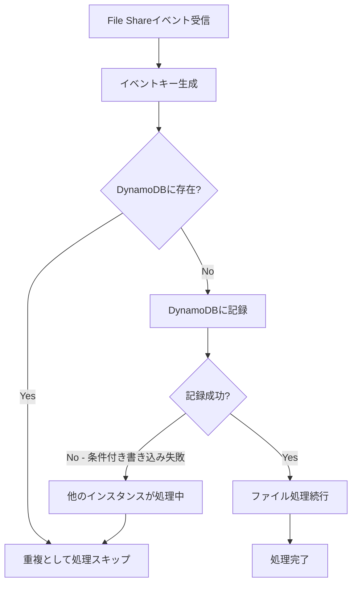

# DynamoDB重複排除システム設計書

## 概要
Slack Botの重複投稿問題を解決するため、AWS DynamoDBを使用した集中管理型のイベント重複排除システムを実装します。

## 問題背景
- 複数のLambdaインスタンスが同時に起動
- 各インスタンスが独自のメモリ空間で`processedEvents` Mapを管理
- インスタンス間で処理済みイベント情報が共有されない
- 結果として同じファイルアップロードに対して複数回の投稿が発生

## システム設計

### 1. DynamoDBテーブル設計

**テーブル名**: `mana-processed-events`

**スキーマ**:
```
Primary Key:
  - event_key (String) - パーティションキー

Attributes:
  - event_key: String (PK)
  - processed_at: Number (Unix timestamp)
  - file_id: String
  - channel_id: String
  - user_id: String
  - lambda_instance_id: String
  - ttl: Number (Unix timestamp for TTL)
```

**TTL設定**:
- TTL属性: `ttl`
- 有効期限: 作成から6時間後（現在の5分から延長）

### 2. 重複チェックフロー



### 3. 実装詳細

#### 3.1 DynamoDBクライアント初期化
```javascript
// api/dynamodb-deduplication.js
const { DynamoDBClient } = require('@aws-sdk/client-dynamodb');
const { DynamoDBDocumentClient, PutCommand, GetCommand } = require('@aws-sdk/lib-dynamodb');

class EventDeduplicationService {
  constructor() {
    const client = new DynamoDBClient({ region: process.env.AWS_REGION || 'us-east-1' });
    this.docClient = DynamoDBDocumentClient.from(client);
    this.tableName = process.env.DEDUP_TABLE_NAME || 'mana-processed-events';
    this.ttlHours = 6; // 6時間後に自動削除
  }
}
```

#### 3.2 重複チェックメソッド
```javascript
async checkAndMarkProcessed(eventKey, metadata) {
  const now = Math.floor(Date.now() / 1000);
  const ttl = now + (this.ttlHours * 3600);
  
  const params = {
    TableName: this.tableName,
    Item: {
      event_key: eventKey,
      processed_at: now,
      ttl: ttl,
      ...metadata
    },
    ConditionExpression: 'attribute_not_exists(event_key)'
  };
  
  try {
    await this.docClient.send(new PutCommand(params));
    return { isNew: true };
  } catch (error) {
    if (error.name === 'ConditionalCheckFailedException') {
      return { isNew: false, reason: 'Already processed by another instance' };
    }
    throw error;
  }
}
```

#### 3.3 index.jsの修正
```javascript
// 既存のインメモリキャッシュを置き換え
const { EventDeduplicationService } = require('./dynamodb-deduplication');
const deduplicationService = new EventDeduplicationService();

// file_shareイベントハンドラ内
const eventKey = eventId || `${fileId}_${message.ts}`;
const metadata = {
  file_id: fileId,
  channel_id: message.channel,
  user_id: message.user,
  lambda_instance_id: context.awsRequestId
};

const { isNew, reason } = await deduplicationService.checkAndMarkProcessed(eventKey, metadata);
if (!isNew) {
  logger.info(`Duplicate event detected (key: ${eventKey}), reason: ${reason}`);
  return;
}
```

### 4. インフラストラクチャ設定

#### 4.1 DynamoDBテーブル作成（CloudFormation/SAM）
```yaml
ProcessedEventsTable:
  Type: AWS::DynamoDB::Table
  Properties:
    TableName: mana-processed-events
    BillingMode: PAY_PER_REQUEST
    AttributeDefinitions:
      - AttributeName: event_key
        AttributeType: S
    KeySchema:
      - AttributeName: event_key
        KeyType: HASH
    TimeToLiveSpecification:
      AttributeName: ttl
      Enabled: true
    Tags:
      - Key: Application
        Value: mana
```

#### 4.2 Lambda IAMロールへの権限追加
```yaml
DynamoDBPolicy:
  Version: '2012-10-17'
  Statement:
    - Effect: Allow
      Action:
        - dynamodb:PutItem
        - dynamodb:GetItem
        - dynamodb:DescribeTable
      Resource: !GetAtt ProcessedEventsTable.Arn
```

### 5. エラーハンドリング

#### 5.1 DynamoDBサービスエラー
- スロットリング: 指数バックオフでリトライ
- サービス利用不可: インメモリフォールバック

#### 5.2 フォールバック戦略
```javascript
class HybridDeduplicationService {
  constructor() {
    this.dynamoService = new EventDeduplicationService();
    this.memoryFallback = new Map();
    this.useFallback = false;
  }
  
  async checkAndMarkProcessed(eventKey, metadata) {
    try {
      if (!this.useFallback) {
        return await this.dynamoService.checkAndMarkProcessed(eventKey, metadata);
      }
    } catch (error) {
      logger.error('DynamoDB error, falling back to memory:', error);
      this.useFallback = true;
      setTimeout(() => { this.useFallback = false; }, 60000); // 1分後に再試行
    }
    
    // メモリフォールバック
    if (this.memoryFallback.has(eventKey)) {
      return { isNew: false, reason: 'In-memory duplicate check' };
    }
    this.memoryFallback.set(eventKey, Date.now());
    return { isNew: true };
  }
}
```

### 6. モニタリングとアラート

#### 6.1 CloudWatchメトリクス
- 重複検出率
- DynamoDBエラー率
- 処理レイテンシ

#### 6.2 ログ出力
```javascript
logger.info('Deduplication check', {
  eventKey,
  result: isNew ? 'new' : 'duplicate',
  dynamodbLatency: latency,
  fallbackMode: this.useFallback
});
```

### 7. 移行計画

1. **Phase 1**: DynamoDBテーブル作成とIAM権限設定
2. **Phase 2**: コード実装とユニットテスト
3. **Phase 3**: ステージング環境でのテスト
4. **Phase 4**: 本番環境への段階的ロールアウト
   - カナリアデプロイメント（10% → 50% → 100%）
5. **Phase 5**: 既存のインメモリ実装の削除

### 8. コスト見積もり

**前提条件**:
- 1日あたり1,000件のファイルアップロード
- 各イベントで平均2回の重複チェック（読み取り）

**月間コスト概算**:
- 書き込み: 30,000件 × $0.25/100万件 = $0.0075
- 読み取り: 60,000件 × $0.25/100万件 = $0.015
- ストレージ: 無視できるレベル（TTLで自動削除）
- **合計**: 約$0.02/月

### 9. テスト戦略

#### 9.1 ユニットテスト
- 重複チェックロジック
- エラーハンドリング
- フォールバック動作

#### 9.2 統合テスト
- 複数Lambdaインスタンスのシミュレーション
- DynamoDBとの通信
- TTL動作確認

#### 9.3 負荷テスト
- 同時実行での重複排除確認
- DynamoDBスロットリング時の動作

### 10. 今後の拡張可能性

1. **イベント履歴の分析**
   - 処理パターンの可視化
   - 異常検知

2. **より高度な重複排除**
   - コンテンツベースの重複検出
   - ファジーマッチング

3. **マルチリージョン対応**
   - グローバルテーブルの使用
   - リージョン間レプリケーション